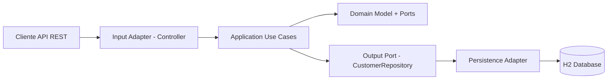

# Audifarma Customer Service

Microservicio en Java para la gestion de clientes y sus direcciones, construido con Spring Boot 3 y Java 21.

## 1) Descripcion general y arquitectura

El servicio permite:
- Crear clientes.
- Consultar un cliente por id.
- Consultar todos los clientes.
- Actualizar un cliente.
- Agregar direcciones a un cliente.
- Eliminar direcciones de un cliente.

La solucion sigue Arquitectura Hexagonal (Ports and Adapters):
- Domain: reglas de negocio puras, modelos, excepciones y puertos.
- Application: implementacion de casos de uso.
- Infrastructure: adaptadores de entrada (REST) y salida (persistencia JPA/H2).

## 2) Estructura de paquetes

```text
src/main/java/com/pruebatecnica/audifarma
├── domain
│   ├── model
│   ├── exception
│   └── ports
│       ├── in
│       └── out
├── application
│   └── usecase
└── infrastructure
    ├── adapters
    │   ├── input/rest
    │   └── output/persistence
    └── entity
```

### Diagrama simplificado



## 3) Requisitos previos

- JDK 21
- Maven 3.9+ (o usar `mvnw`)
- Docker Desktop
- kubectl
- (Opcional) Minikube o Docker Desktop Kubernetes para despliegue local

## 4) Ejecutar localmente con Maven

```bash
./mvnw clean test
./mvnw spring-boot:run
```

En Windows PowerShell:

```powershell
.\mvnw.cmd clean test
.\mvnw.cmd spring-boot:run
```

URLs utiles:
- API base: `http://localhost:8080/api/customers`
- Swagger UI: `http://localhost:8080/swagger-ui/index.html`
- OpenAPI JSON: `http://localhost:8080/v3/api-docs`
- Actuator Health: `http://localhost:8080/actuator/health`
- H2 Console: `http://localhost:8080/h2-console`

## 5) Construir y ejecutar con Docker

### Opcion A: docker-compose.yml

```bash
docker compose up --build -d
```

Detener:

```bash
docker compose down
```

### Opcion B: Docker manual

```bash
docker build -t audifarma:local .
docker run --rm -p 8080:8080 --name audifarma audifarma:local
```

## 6) Despliegue en Kubernetes

### 6.1 Construir imagen

```bash
docker build -t audifarma:local .
```

Si usas Minikube, carga la imagen:

```bash
minikube image load audifarma:local
```

### 6.2 Aplicar manifiestos

```bash
kubectl apply -f k8s/
```

Verificar:

```bash
kubectl get deploy,po,svc
kubectl describe deployment audifarma
```

Port-forward para probar localmente:

```bash
kubectl port-forward service/audifarma 8080:80
```

### 6.3 Health probes (liveness y readiness)

En `k8s/deployment.yaml` se configuran:
- liveness: `/actuator/health/liveness`
- readiness: `/actuator/health/readiness`

Esto aprovecha Spring Boot Actuator con probes habilitadas en `application.yml`.

## 7) Ejemplos curl para consumir la API

### Crear cliente

```bash
curl -X POST http://localhost:8080/api/customers \
  -H "Content-Type: application/json" \
  -d '{
    "firstName":"Laura",
    "lastName":"Ramirez",
    "documentNumber":"9001",
    "documentType":"CC",
    "age":27
  }'
```

### Obtener cliente por id

```bash
curl http://localhost:8080/api/customers/{customerId}
```

### Listar clientes

```bash
curl http://localhost:8080/api/customers
```

### Actualizar cliente

```bash
curl -X PUT http://localhost:8080/api/customers/{customerId} \
  -H "Content-Type: application/json" \
  -d '{
    "firstName":"Laura Maria",
    "lastName":"Ramirez Gomez",
    "documentNumber":"9002",
    "documentType":"CE",
    "age":28,
    "active":true
  }'
```

### Agregar direccion

```bash
curl -X POST http://localhost:8080/api/customers/{customerId}/addresses \
  -H "Content-Type: application/json" \
  -d '{
    "departament":"Antioquia",
    "city":"Medellin",
    "fullAddress":"Calle 10 #20-30"
  }'
```

### Eliminar direccion

```bash
curl -X DELETE http://localhost:8080/api/customers/{customerId}/addresses/{addressId}
```

## 8) Pruebas

- Unitarias: JUnit 5 + Mockito para casos de uso.
- Integracion: `@SpringBootTest` + MockMvc para endpoints REST.

Ejecucion:

```bash
./mvnw test
```
